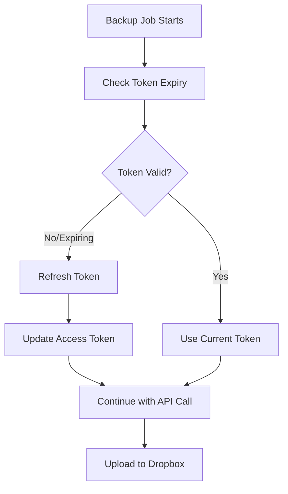

# Dropbox OAuth2 Implementation Guide

## Overview

This guide explains how to implement and use the OAuth2 refresh token system for Dropbox integration. The OAuth2 implementation solves the problem of access tokens expiring every 4 hours by automatically refreshing them using refresh tokens.

## Architecture

### Components

1. **DropboxTokenManager** (`internal/adapter/dropbox_oauth.go`)
   - Manages access and refresh tokens
   - Automatically refreshes expired tokens
   - Thread-safe with mutex protection

2. **DynamicDropboxClient** (`internal/adapter/dropbox_dynamic_client.go`)
   - Wraps the Dropbox SDK client
   - Automatically refreshes tokens before API calls
   - Transparent to existing backup code

3. **OAuth2 Setup Command** (`cmd/dropbox_oauth.go`)
   - Helper command to generate authorization URLs
   - Exchange authorization codes for tokens
   - Update environment configuration

## Setup Process

### Step 1: Dropbox App Configuration

1. Go to [Dropbox App Console](https://www.dropbox.com/developers/apps)
2. Create a new app or use existing app
3. Note down your **App Key** and **App Secret**
4. Set redirect URI to `http://localhost:8080/auth/dropbox/callback` (or your preferred URI)

### Step 2: Environment Variables

Add the following to your `.env` file:

```bash
# Required: Get these from Dropbox App Console
DROPBOX_APP_KEY=your_app_key_here
DROPBOX_APP_SECRET=your_app_secret_here

# Optional: Custom redirect URL (defaults to localhost:8080)
DROPBOX_REDIRECT_URL=http://localhost:8080/auth/dropbox/callback

# These will be generated in Step 3
DROPBOX_ACCESS_TOKEN=will_be_generated
DROPBOX_REFRESH_TOKEN=will_be_generated
```

### Step 3: OAuth2 Authorization Flow

#### 3.1 Generate Authorization URL

```bash
./kaffah-finance dropbox-oauth --action=auth
```

This will output:

- Authorization URL to open in browser
- Instructions for next steps

#### 3.2 User Authorization

1. Open the generated URL in your browser
2. Authorize your application
3. Copy the authorization code from the callback URL

#### 3.3 Exchange Code for Tokens

```bash
./kaffah-finance dropbox-oauth --action=exchange --code=YOUR_AUTH_CODE
```

This will:

- Exchange the code for access and refresh tokens
- Display the tokens
- Optionally update your `.env` file

### Step 4: Update Environment

Add the generated tokens to your `.env` file:

```bash
DROPBOX_ACCESS_TOKEN=your_generated_access_token
DROPBOX_REFRESH_TOKEN=your_generated_refresh_token
```

## How It Works

### Automatic Token Refresh

The system automatically handles token refresh:

1. **Token Validation**: Before each API call, check if token expires within 5 minutes
2. **Automatic Refresh**: If token is expired/expiring, refresh using refresh token
3. **Transparent Operation**: Backup process continues without interruption
4. **Thread Safety**: Multiple operations can safely refresh tokens concurrently

### Token Refresh Flow



### Error Handling

- **Refresh Token Expired**: Log error and require manual re-authorization
- **Network Issues**: Retry with exponential backoff
- **Invalid Tokens**: Clear tokens and require re-authorization

## Usage Examples

### Testing Token Refresh

```bash
# Test backup with OAuth2 system
./kaffa-finance cronjob --once
```

### Checking Token Status

The system logs token refresh activities:

```bash
# Look for these log messages
grep "access token expired" logs/app.log
grep "access token refreshed successfully" logs/app.log
```

### Manual Token Refresh

```go
// In your code, you can manually check token status
tokenManager := adapter.Adapters.DropboxTokenManager
validToken, err := tokenManager.GetValidToken()
if err != nil {
    log.Error().Err(err).Msg("Failed to get valid token")
}
```

## Configuration Details

### Dropbox Configuration Structure

```go
type Config struct {
    // ... other config
    Dropbox struct {
        AccessToken  string `env:"DROPBOX_ACCESS_TOKEN"`  // Generated during OAuth
        RefreshToken string `env:"DROPBOX_REFRESH_TOKEN"` // Generated during OAuth
        AppKey       string `env:"DROPBOX_APP_KEY"`       // From Dropbox Console
        AppSecret    string `env:"DROPBOX_APP_SECRET"`    // From Dropbox Console
        RedirectURL  string `env:"DROPBOX_REDIRECT_URL"`  // OAuth redirect URI
    }
}
```

### Token Manager Configuration

```go
// Token manager initialization
tokenManager := NewDropboxTokenManager(
    config.Envs.Dropbox.AccessToken,  // Current access token
    config.Envs.Dropbox.RefreshToken, // Long-lived refresh token
    config.Envs.Dropbox.AppKey,       // App credentials
    config.Envs.Dropbox.AppSecret,    // App credentials
)
```

## Monitoring and Maintenance

### Log Messages

Monitor these key log messages:

```bash
# Token refresh events
"access token expired or about to expire, refreshing"
"access token refreshed successfully"

# Error conditions
"no refresh token available"
"token refresh failed"
"failed to get valid token"
```

### Health Checks

```bash
# Create a simple health check script
#!/bin/bash

# Check if tokens are configured
if [ -z "$DROPBOX_ACCESS_TOKEN" ] || [ -z "$DROPBOX_REFRESH_TOKEN" ]; then
    echo "ERROR: Dropbox tokens not configured"
    exit 1
fi

# Test backup once
./kaffa-finance cronjob --once
if [ $? -eq 0 ]; then
    echo "OK: Backup with OAuth2 successful"
else
    echo "ERROR: Backup failed"
    exit 1
fi
```

### Token Rotation

Refresh tokens typically last for years, but you should:

1. **Monitor Logs**: Watch for refresh failures
2. **Periodic Testing**: Test backup functionality regularly
3. **Re-authorization**: Be prepared to re-run OAuth flow if needed

## Troubleshooting

### Common Issues

#### 1. "no refresh token available"

**Cause**: Refresh token is missing or empty
**Solution**: Re-run OAuth2 setup process

```bash
./kaffa-finance dropbox-oauth --action=auth
# Follow the process to get new tokens
```

#### 2. "token refresh failed with status 400"

**Cause**: Invalid refresh token or app credentials
**Solution**:

1. Verify app key and secret in Dropbox console
2. Re-run OAuth2 authorization
3. Check for typos in environment variables

#### 3. "failed to refresh client before upload"

**Cause**: Network issues or token problems
**Solution**:

1. Check internet connectivity
2. Verify Dropbox service status
3. Re-run OAuth2 setup if needed

#### 4. OAuth redirect URL mismatch

**Cause**: Redirect URL in app doesn't match configuration
**Solution**:

1. Update Dropbox app settings to match your `DROPBOX_REDIRECT_URL`
2. Or update `DROPBOX_REDIRECT_URL` to match app settings

### Debug Steps

1. **Verify Configuration**:

   ```bash
   # Check if all variables are set
   env | grep DROPBOX
   ```

2. **Test OAuth Flow**:

   ```bash
   # Generate new auth URL
   ./kaffa-finance dropbox-oauth --action=auth
   ```

3. **Check Logs**:

   ```bash
   # Watch real-time logs during backup
   tail -f logs/app.log | grep -i dropbox
   ```

4. **Manual Token Test**:

   ```bash
   # Test backup once to verify tokens
   ./kaffa-finance cronjob --once
   ```

## Security Considerations

### Token Storage

- **Environment Variables**: Store tokens in environment variables, not in code
- **File Permissions**: Secure `.env` file permissions (600 or 644)
- **Version Control**: Never commit `.env` files to version control

### Token Lifecycle

- **Access Tokens**: 4-hour lifespan, automatically refreshed
- **Refresh Tokens**: Long-lived (years), store securely
- **App Credentials**: Keep app key and secret secure

### Best Practices

1. **Rotate Regularly**: Consider periodic re-authorization
2. **Monitor Access**: Review Dropbox app access logs
3. **Limit Scope**: Use minimum required permissions
4. **Backup Tokens**: Securely backup refresh tokens

## Integration with Existing Systems

### Backup Process

The OAuth2 system integrates seamlessly with existing backup:

```go
// Before: Direct Dropbox client
dbx := files.New(dropbox.Config{Token: staticToken})

// After: Dynamic client with auto-refresh
dbx := adapter.Adapters.DropboxFiles // Automatically handles token refresh
```

### Service Deployment

Update your service deployment to include OAuth2 variables:

```yaml
# docker-compose.yml
environment:
  - DROPBOX_APP_KEY=${DROPBOX_APP_KEY}
  - DROPBOX_APP_SECRET=${DROPBOX_APP_SECRET}
  - DROPBOX_ACCESS_TOKEN=${DROPBOX_ACCESS_TOKEN}
  - DROPBOX_REFRESH_TOKEN=${DROPBOX_REFRESH_TOKEN}
```

```ini
# systemd service
EnvironmentFile=/path/to/.env
```

## Migrating from Static Tokens

### Before OAuth2

```bash
# Old environment setup
DROPBOX_ACCESS_TOKEN=static_token_expires_in_4_hours
```

### After OAuth2

```bash
# New environment setup
DROPBOX_APP_KEY=your_app_key
DROPBOX_APP_SECRET=your_app_secret
DROPBOX_ACCESS_TOKEN=automatically_refreshed_token
DROPBOX_REFRESH_TOKEN=long_lived_refresh_token
```

### Migration Steps

1. **Backup Current Token**: Save current access token as fallback
2. **Run OAuth Setup**: Follow OAuth2 setup process
3. **Test New System**: Run backup with `--once` flag
4. **Update Production**: Deploy with new environment variables
5. **Monitor**: Watch logs for successful token refresh events

## Conclusion

The OAuth2 implementation provides:

- **Automatic Token Refresh**: No more 4-hour token expiration issues
- **Seamless Integration**: Works with existing backup code
- **Robust Error Handling**: Graceful handling of token issues
- **Easy Setup**: Simple command-line tools for configuration
- **Production Ready**: Thread-safe and reliable for long-running services

The system is now ready for production use with automated, long-term Dropbox backup functionality.
